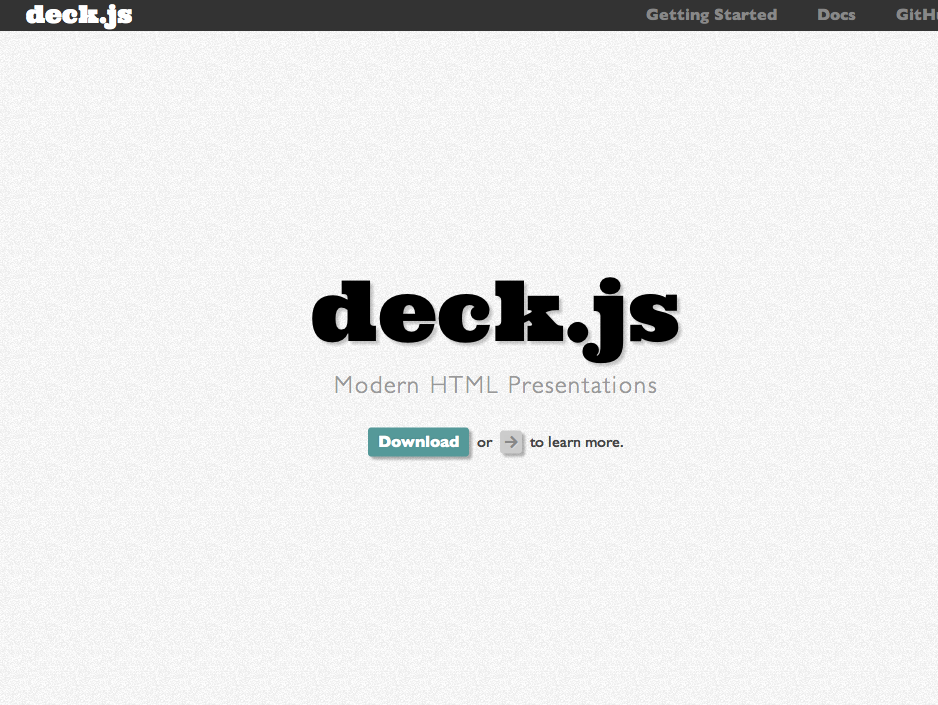
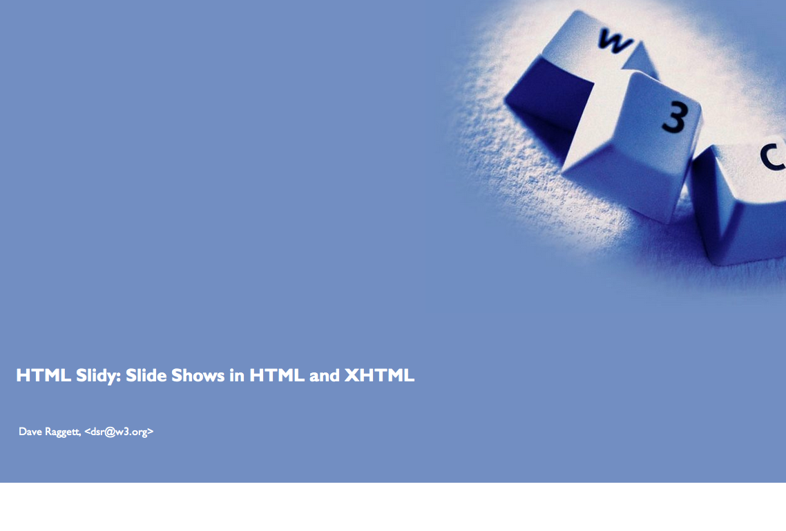
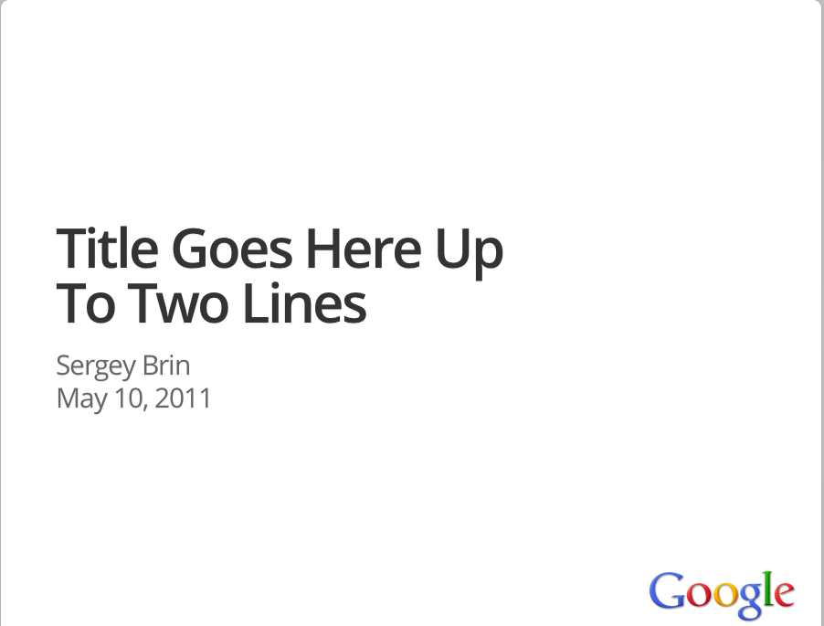

--- fill

```{r setup, echo = F, eval = F}
library(knitr)
opts_knit$set(out.format = 'html')
opts_chunk$set(highlight = TRUE, tidy = FALSE)
```

<h1>
  <span class = 'yellow'>Slidify</font><br/>
  <span class = 'white' style = 'font-size: 0.7em;'>
    Reproducible HTML5 Slides
  </span><br/>
  <span class = 'white' style = 'font-size: 0.5em;'>
    by Ramnath Vaidyanathan
  </span>
</h1>


---

### Overview ###

The objective of `slidify` is to make it easy to create reproducible HTML5 presentations from `.Rmd` files. 

The guiding philosophy of `slidify` is to completely separate writing of content from its rendering, so that content can be written once in `R Markdown`, and rendered as an `HTML5` presentation using any of the `HTML5` slide frameworks supported.

---

# Motivation #

---

# Several HTML5 slide frameworks exist... #

--- fill

### deck.js ###




--- fill

### slidy ###



--- fill

### html5slides ###



---

### ... but it is a pain to write HTML ###

---


### Installation ###

This package is not available on `CRAN` as yet. A development version can be installed from `github` using the `devtools` package. 

```{r eval = F}
library(devtools)
install_github('slidify', 'ramnathv')
```

In addition to `slidify`, you would also need to install development versions of `knitr`, `whisker` and `markdown`.

```{r eval = F}
install_github('knitr', 'yihui')
install_github('whisker', 'edwindj')
install_github('markdown', 'rstudio')
```
 
--- 


### Usage ###

`slidify` is designed to make it very easy for a HTML novice to generate a crisp, visually appealing `HTML5` slide deck. You can do it in just three steps!

* Write your [source](slides.Rmd) file in [R Markdown](http://goo.gl/KKdaf)
* Separate your slides using a horizontal rule `---`
* Run `slidify("slides.Rmd")` to generate your [slide deck](slides.html).

---

# Customizing Your Presentation #

---

### Options ###

`slidify` aims to provide a high degree of customization for the more advanced users. You can access the options currently available by typing `slidifyOptions()` at the command line. The main options are

     framework       : slide generation framework to use
     theme           : theme to use for styling slide content
     transition      : theme to use for slide transitions
     highlighter     : tool to use for syntax highlighting
     histyle         : style to use for syntax highlighting
     copy_libraries  : should library files be copied to slide directory
     lib_path        : path to libraries (framework, highlighter)
     layout          : slide layout to use
     template        : slide template to use
     mathjax         : should mathjax be used
     embed           : should local files be embedded
     
The next few slides provide a more detailed overview of each of these options and what values they can take.

---

### framework ###

`slidify` allows you to render your slides using several HTML5 slide frameworks. Currently supported frameworks are:

* [deck.js](http://imakewebthings.com/deck.js/)
* [dzslides](http://paulrouget.com/dzslides/)
* [html5slides](http://html5slides.googlecode.com/)
* [shower](http://pepelsbey.github.com/shower/en.htm)
* [slidy](http://www.w3.org/Talks/Tools/Slidy2/Overview.html#(1))

Extending `slidify` to accommodate other frameworks is pretty straightforward. The plan is to support more frameworks over time.

---

### theme ###

The `theme` option lets you style your slides. Currently, this option is available only for `deck.js` which allows the following themes

* web-2.0
* swiss
* neon

Themes are just `css` files. So it is easy to extend this option to the other frameworks if you can write css. 

---

### transition ###

The `transition` option allows you to define the transition between slides. Currently, this option is available only for `deck.js` which allows the following transitions

* horizontal-slide [default]
* vertical-slide
* fade

Please consult [deck.js](http://goo.gl/UFthM) documentation for more information on `themes` and `transitions`


---

### highlighter ###

`slidify` is designed to be modular and syntax highlighting is one module. Currently two options are supported

* `highlight.js` 
* `highlight`

The `highlight.js` option does client side highlighting using the javascript library [highlight.js](http://softwaremaniacs.org/soft/highlight/en/), while the `highlight` option generates a static page, highlighted using the R package [highlight](http://goo.gl/uy8Ww). 

You will notice that the quality of highlighting for `R` code is better when done with the `R` package, rather than `highlight.js`. 

It would be straightforward to add other `javascript` based syntax highlighters like `google.prettify`, `shJS` etc.


---

### histyle ###

`slidify` allows you complete control over how you want to style your source code using `css`. The styles currently supported depend on the `highlighter` chosen.

* `highlight.js` :  see its [documentation](http://goo.gl/uEJj). 
* `highlight` : type `knit_theme[['get']]()` to see available styles


In order to use the `R` option, you need to include the line `opts_knit$set(out.format = 'html')` inside your `.Rmd` file. This is required to fool `knitr` into highlighting source code. Specifying it outside the document does not work as `knitr` resets it to `md` as soon as it sees the `.Rmd` extension.

---

### mathjax ###

Setting `mathjax` to true allows you to write math in your presentations. `slidify` automatically adds a link to the required `js` files from Mathjax CDN. 

$$latex
\begin{aligned}
\nabla \times \vec{\mathbf{B}} -\, \frac1c\, \frac{\partial\vec{\mathbf{E}}}{\partial t} & = \frac{4\pi}{c}\vec{\mathbf{j}} \\   \nabla \cdot \vec{\mathbf{E}} & = 4 \pi \rho \\
\nabla \times \vec{\mathbf{E}}\, +\, \frac1c\, \frac{\partial\vec{\mathbf{B}}}{\partial t} & = \vec{\mathbf{0}} \\
\nabla \cdot \vec{\mathbf{B}} & = 0 \end{aligned}
$$

A cross-product formula, again from the Mathjax website

$$latex
\mathbf{V}_1 \times \mathbf{V}_2 =  \begin{vmatrix}
\mathbf{i} & \mathbf{j} & \mathbf{k} \\
\frac{\partial X}{\partial u} &  \frac{\partial Y}{\partial u} & 0 \\
\frac{\partial X}{\partial v} &  \frac{\partial Y}{\partial v} & 0
\end{vmatrix}
$$

--- build

### Animated Lists ###

It is easy to animate a list by adding the class specified `build`. For example, consider the `markdown` source below

    * Point 1
    * Point 2
    * Point 3

It produces the slide

* Point 1
* Point 2
* Point 3
    
---

### Issues ###

Different `HTML5` slide generation frameworks style the same elements differently. Moreover, they use different classes to define incremental builds, full page assets/media etc.

As a result, a slide deck that looks visually appealing in one framework, may not look as nice in another. It will require carefully overriding the `css` definitions across frameworks so as to reach some kind of consistency.

The long-term goal of `slidify` is to be able to truly stand by the "write once, style as you like" idea. 

--- smaller


### License ###

`slidify` is made available under the MIT License. The `slidify` logo was created using [supalogo](http://goo.gl/zmJHP). All included `css` and `javascript` are licensed under the terms specified by the respective slide generation frameworks.

**Copyright (C) 2012 Ramnath Vaidyanathan**

Permission is hereby granted, free of charge, to any person obtaining a copy of this software and associated documentation files (the "Software"), to deal in the Software without restriction, including without limitation the rights to use, copy, modify, merge, publish, distribute, sublicense, and/or sell copies of the Software, and to permit persons to whom the Software is furnished to do so, subject to the following conditions:

The above copyright notice and this permission notice shall be included in all copies or substantial portions of the Software.

THE SOFTWARE IS PROVIDED "AS IS", WITHOUT WARRANTY OF ANY KIND, EXPRESS OR IMPLIED, INCLUDING BUT NOT LIMITED TO THE WARRANTIES OF MERCHANTABILITY, FITNESS FOR A PARTICULAR PURPOSE AND NONINFRINGEMENT. IN NO EVENT SHALL THE AUTHORS OR COPYRIGHT HOLDERS BE LIABLE FOR ANY CLAIM, DAMAGES OR OTHER LIABILITY, WHETHER IN AN ACTION OF CONTRACT, TORT OR OTHERWISE, ARISING FROM, OUT OF OR IN CONNECTION WITH THE SOFTWARE OR THE USE OR OTHER DEALINGS IN THE SOFTWARE.

---

# References #

---

### HTML5 Slides and R ###


1. [An Introduction to R](http://goo.gl/L79xW)
2. [How to Make HTML Slides with knitr](http://goo.gl/7C907)
3. [Fancy HTML5 Slides with knitr and Pandoc](http://goo.gl/Uqnq3)
4. [Visualize World Bank Data](http://goo.gl/QlTA4)
5. [Interactive Presentations with deck.js](http://goo.gl/kdhBO)

---

### R Markdown and knitr ###

1. [Interactive Reports in R with knitr and RStudio](http://goo.gl/oTeV5)
2. [Getting Started with R Markdown, knitr and RStudio](http://goo.gl/ALjtQ)
3. [Dynamic Content RStudio, Markdown and Marked](http://goo.gl/84D5E)
4. [Using Markdown with RStudio](http://goo.gl/KKdaf)
5. [Example Reproducible Report using R Markdown](http://goo.gl/ZQF1u)
6. [Interactive Slides with R, googleVis and knitR](http://goo.gl/cVS9W)
7. [knitr, Slideshows and Dropbox](http://goo.gl/ZTSD7)

--- smaller fill

```{r echo = F, comment = NA}
slidifyOptions()
```


